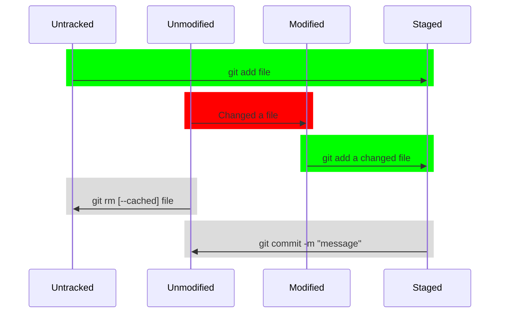
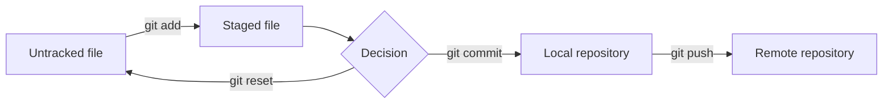

# About Git

## Make a fork of the course repository

Go to https://github.com/fictive-reality/devops22-python and click the fork button in the upper right corner. This creates a linked copy of the repository on your GitHub profile.

## Get a copy of the course repository

First, in the termnal, navigate to a folder where you want to keep your code, e.g. `~/repos` on Mac/Linux or `C:/Users/USERNAME/My Documents/code` on Windows. To create a new folder, write `mkdir FOLDERNAME`. Make sure you have entered the folder (`cd FOLDER` to change to that folder).

The command `git clone` will create a local copy of a repository. To get the correct URL to clone, go to your new forked repository (would typically be on the URL https://github.com/YOUR-USERNAME/devops22-python). Click the green button that says "Code" and select the HTTPS method to clone. Type the command in the terminal.

If you use `git clone <url>` without options, it will create a folder named as the repository, i.e in this example the folder name will be `devops22-python`.

## Configure Git

Before you commit you should config your `user.name` and `user.email`. Email should match your email used on GitHub, otherwise GitHub cannot understand it's you.

```bash
# Set globally, i.e same for all
git config --global user.name "Firstname Lastname"
git config --global user.email "youremail@yh.nackademin.se"
```

<div class="page"/>

## Local Files in Git

Files can either be `Untracked` or `Tracked`. If a file is tracked it recognized by git, a tracked file can be either `Unmodified`, `Modified` or `Staged`. You can see the status of all files with `git status`.



You can see git as its own filesystem, before it's added it will show as `Untracked`.

```bash
# Within your working directory create a file, on linux/mac
touch my_new_file

# Run `git status`
git status
```

The output:

```text
On branch main
Your branch is up to date with 'origin/main'.

Untracked files:
  (use "git add <file>..." to include in what will be committed)
        my_new_file

nothing added to commit but untracked files present (use "git add" to track)
```

To track the file:

```bash
# Add the file to git
git add my_new_file

# Run git status
git status
```

The output:

```text
On branch main
Your branch is up to date with 'origin/main'.

Changes to be committed:
  (use "git restore --staged <file>..." to unstage)
        new file:   my_new_file
```

To record the staged file

```bash
# Use git commit
git commit -m "A message"
```

<div class="page"/>

## Push files to remote in Git

So far all changes has been local, in a distributed project you will usually have a git server i.e GitLab or GitHub. In our case we have already cloned a remote project `devops22-python`. When working multiple persons in a project it's good practice to use branches and add changes to the project through a `pull request`.

Basic flow adding a file to git



```bash
# To view our commits use git log
git log

# From the log output copy the commit sha before your change
# We will use git reset --hard <commit sha> to throw away all changes. *USE WITH CAUTION*
git reset --hard <commit sha from git log>
```

Now when the main branch is restored we can create a branch for our changes

```bash
# Make sure you are currently working on main, a asterisk mark current branch
git branch 

# Create a branch from current working directory
git branch your_username

# Try again to run git branch, you should now see that a new branch is created
git branch

# Change to the branch with git switch
git switch your_username

# Create a file, add it and commit it.
touch my_file # works on linux/mac
git add my_file
git commit -m "added a example file"

# To push the changes to GitHub use git push
git push
```

The first time you push to a branch it will output:

```text
fatal: The current branch your_username has no upstream branch.
To push the current branch and set the remote as upstream, use

    git push --set-upstream origin your_username
```

It's required to set the upstream before you can successfully push, so just rerun the push once with:

```bash
git push --set-upstream origin your_username
```

Go to the GitHub repository and verify your change has been uploaded.

<div class="page"/>

## Pull latest file updates from remote in git

To get updates, i.e the last lessons code examples or todays lesson you need to fetch the changes from GitHub. But before you try to get new changes you should always save your current work. Run `git status` to make sure you have no `Untracked` or `Modified` files. `git status` will also show which branch you are currently on. If all files are in order it should output:

```text
On branch your_username
Your branch is up to date with 'origin/your_username'.

nothing to commit, working tree clean
```

```bash
# To pull the latest changes you can either switch back to main then do a git pull
git switch main
git pull

# Alternatively to update the current branch
git pull origin main 
```
