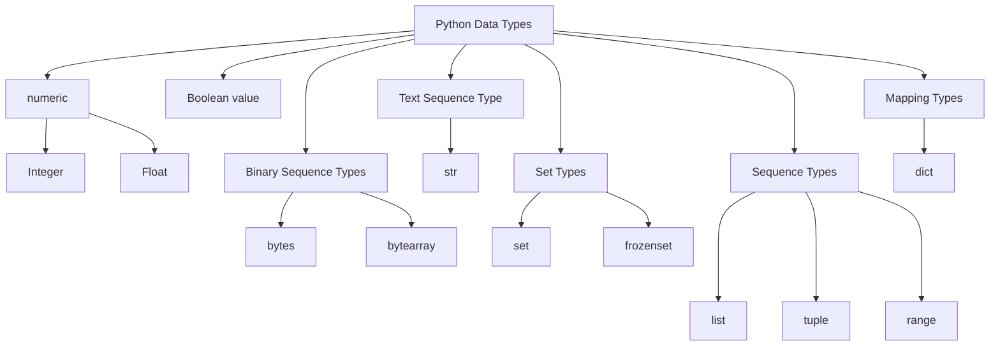

# Data Types

```mermaid
graph TD
    dt[Python Data Types] --> num[numeric]
    num --> int[Integer]
    num --> float[Float]
    dt --> bool[Boolean value]
    dt ---> seq[Sequence Types]
    seq ---> list
    seq ---> tuple
    seq ---> range
    dt --> text[Text Sequence Type]
    text --> str
    dt ---> bin[Binary Sequence Types]
    bin --> bytes
    bin --> bytearray
    dt ---> sets[Set Types]
    dt --> map[Mapping Types]
    map --> dict
    
    sets --> set
    sets --> frozenset
```
